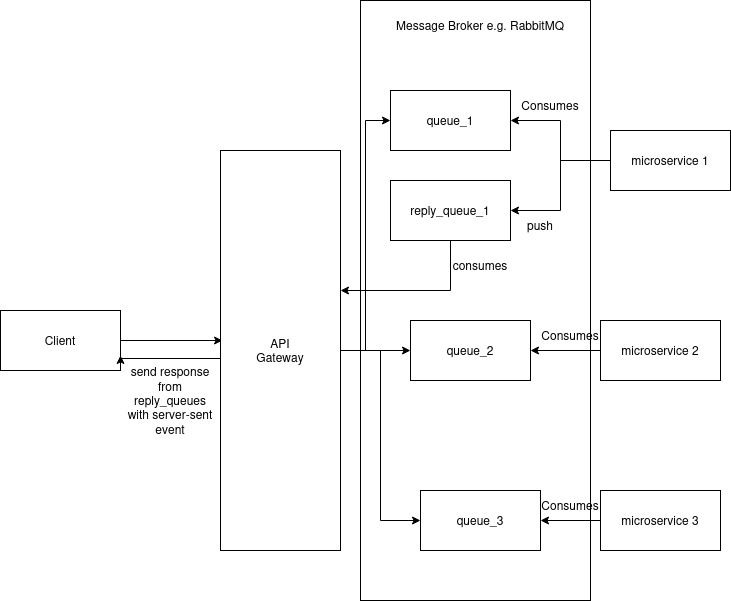

# Golang web API with rabbit MQ
This is a simple API to test the difference between http request and message queue as a way to communicate between API gateway to microservices or microservice to other microservices.
This is not an enterprise codebase but only code to see the difference between request response pattern and message queue pattern

## How to start
Start RabbitMQ through docker
```bash
$ docker-compose up
```

Start API gateway
```bash
$ cd api-gateway-demo
$ go run server.go
```

Start the microservice
```bash
$ cd go-practice
$ go run server.go
```

## Benefit of API gateway
- Decouple shared logic e.g. Authorization, rate limiting, logging with the microservices
- Able to translate request to other protocol e.g. http request to http2 request to a grpc microservice
- Aggregate request and response, if client need data from different microservices, API gateway can aggregate it reducing client requests to multiple microservices
## Benefit Of Message Queue
- Unlike simple HTTP request, message queue able to store the request if a microservice go down, when the microservice is available, it will continue to process the queue
- If the message queue go down, it can store the queue in disk if it was set properly
- Able to reduce the workload of microservices
- It is asynchronous

### How the producer of the queue can send the response
**HTTP polling** or **server-sent event**, i haven't set this yet

## Architecture Diagram



